# MySQL

## 第一章MySQL

### 第一节什么是MySQL?

​	mysql不知道是什么，没有比去官方文档更加清晰https://www.mysql.com/，找到[DOCUMENTATION](https://dev.mysql.com/doc/)（就是文档的意思）这里我们使用8.0的官方文档https://dev.mysql.com/doc/refman/8.0/en/，虽然官方文档没有说，我们可以百度，看完百度的简绍你是不是还是不知道这是个啥？

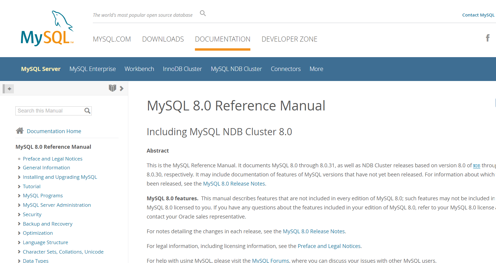


​	简单的说：就是一个数据管理系统，免费的。后面我会详细简。有人会说：我们电脑硬盘空间现在都是500G起步,还不够存数据的吗？

​	mysql核心点不是在存储上面，是在管理上面，看到管理两个字，大部分的想法就是管理就是分类嘛，当然这个理解是错误的。

​	肯定不是分类这么简单，数据库：把数据保存到可掉电存储设备中以供使用。简单一句话：硬盘断电也可以恢复存储。提供数据存储的温度性。

​	相信看到这里你对于mysql有一点了解了，下面我们说一下mysql的基础功能:

insert into添加数据

select查询数据

delete删除数据  

 update修改数据 

增删查改知道，恭喜你已经入门了，下面我们需要div来达到进准查询到我们想要的结果

*： 全部关键字，不建议使用，

from ：通过某个表

where： 条件，

假设我们有1亿万条数据，直接查询效率肯定低，为了提高他的速度便有索引。

读到这里你应该大概知道mysql是什么了。

### 第二节mysql的历史

MySQL是一个 开放源代码的关系型数据库管理系统 ，由瑞典MySQL AB（创始人Michael Widenius）公 司1995年开发，迅速成为开源数据库的 No.1。

 2008被 Sun 收购（10亿美金），2009年Sun被 Oracle 收购。 MariaDB 应运而生。（MySQL 的创 造者担心 MySQL 有闭源的风险，因此创建了 MySQL 的分支项目 MariaDB）

 MySQL和MariaDB本质上没有什么区别，你会了MySQL可以约等于你会了MariaDB.。

我们直接上链接看一下MySQL到底排多少名?

[DB-Engines Ranking - popularity ranking of database management systems](https://db-engines.com/en/ranking)

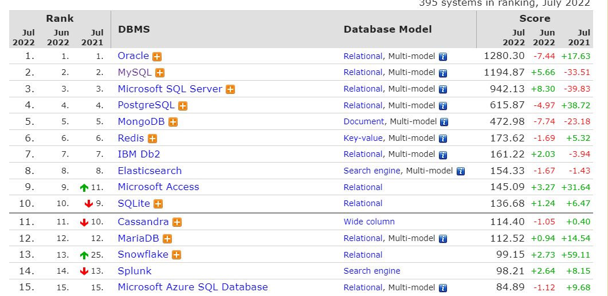

看图很明显MySQL排第二。

### 第三节MySQL详细简绍

说MySQL之前我们先来讲解三个概念：数据库、数据库管理、SQL。

| 名称           | 简绍                                                         | 简称                             |
| -------------- | :----------------------------------------------------------- | -------------------------------- |
| 数据库         | 即存储数据的“仓库”，其本质是一个文件系统。它保存了一系列有组织的数据 | DataBase（DB）                   |
| 数据库管理系统 | 是一种操纵和管理数据库的大型软件，用于建立、使用和维护数据库，对数据库进行统一管理和控制。用户通过数据库管理系统访问数据库中表内的数据。 | DataBase ManagementSystem (DBMS) |
| SQL            | 专门用来与数据库通信的语言。                                 | Structured Query                 |

上一节中看见MySQL的排名，目前是第二，下面简绍一下MySQL的竞争对手

Oracle：和甲骨文公司Oracle同名，不免费收费,大型数据库，现在的行业大哥。

MySQL：分为社区版本和商业版 中小型数据库。老二

SQL Server：Microsoft 微软公司推出的收费的中型数据库，C#、.net等语言常用。

PostgreSQL：开源免费的中小型数据库。

DB2：IBM公司的大型收费数据库产品，常应用在银行系统中。。

 MariaDB：MySQL亲兄弟可以说是孪生兄弟 ，免费。

**MySQL概述**：

```
MySQL是一个 开放源代码的关系型数据库管理系统 ，由瑞典MySQL AB（创始人Michael Widenius）公 司1995年开发，迅速成为开源数据库的 No.1。
2008被 Sun 收购（10亿美金），2009年Sun被 Oracle 收购。 MariaDB 应运而生。（MySQL 的创造者担心 MySQL 有闭源的风险，因此创建了 MySQL 的分支项目 MariaDB） MySQL6.x 版本之后分为 社区版 和 商业版 。
MySQL是一种关联数据库管理系统，将数据保存在不同的表中，而不是将所有数据放在一个大仓库内，这样就增加了速度并提高了灵活性。
MySQL是开源的，所以你不需要支付额外的费用。
MySQL是可以定制的，采用了 GPL（GNU General Public License） 协议，你可以修改源码来开发自己的MySQL系统。
MySQL支持大型的数据库。可以处理拥有上千万条记录的大型数据库。
MySQL支持大型数据库，支持5000万条记录的数据仓库，32位系统表文件最大可支持 4GB ，64位系统支持最大的表文件为 8TB 。 MySQL使用 标准的SQL数据语言 形式。
MySQL可以允许运行于多个系统上，并且支持多种语言。这些编程语言包括C、C++、Python、 Java、Perl、PHP和Ruby等。
```

**MySQL是什么类型的数据库？**

从排名中我们能看出来，关系型数据库绝对是 DBMS 的主流，其中使用最多的 DBMS 分别是 Oracle、 MySQL 和 SQL Server。这些都是关系型数据库（RDBMS）。

**实质**

​		这种类型的数据库是 最古老 的数据库类型，关系型数据库模型是把复杂的数据结构归结为简单的二元关系 （即二维表格形式。

​		关系型数据库以 行(row) 和 列(column) 的形式存储数据，以便于用户理解。这一系列的行和列被SQL 就是关系型数据库的查询语言。

**优势**

复杂查询：可以用SQL语句方便在一个表以及多个表之间做非常复杂数据查询。

事物查询：使得对于安全性能很高的数据访问要求得以实现。

### 第四节安装MySQL

MySQL官方提供了两种不同的版本：

社区版本（MySQL Community Server）

​	1）免费， MySQL不提供任何技术支持

​	2）商业版本（MySQL Enterprise Edition）

​		收费，可以使用30天，官方提供技术支持

MySQL有两种安装方式，一种是解压版，一种是安装包版。

安装包下载路径

[MySQL :: Download MySQL Installer (Archived Versions)](https://downloads.mysql.com/archives/installer/)

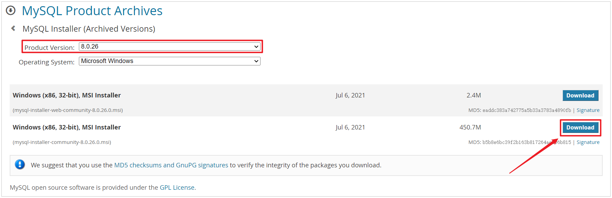

解压版，安装路径

https://downloads.mysql.com/archives/community/

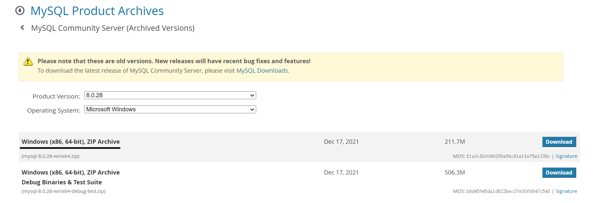

​	解压版直接解压就可以用，这里给各位一个小建议文件名不要有中文，

#### 4-1安装包安装

**步骤1**：双击官方下来的安装包文件，版本不一定跟我一样。


**步骤2**打开“Choosing a Setup Type”（选择安装类型）窗口，在其中列出了5种安装类型，分别是

Developer Default（默认安装类型）、Server only（仅作为服务器）、Client only（仅作为客户端）、Full（完全安装）、Custom（自定义安装）。这里选择“Custom（自定义安装）”类型按钮，单击“Next(下

一步)”按钮。绝对麻烦可以选择默认安装


**步骤3**：打开“Select Products” （选择产品）窗口，可以定制需要安装的产品清单。例如，选择“MySQL Server 8.0.26-X64”后，单击“→”添加按钮，即可选择安装MySQL服务器，如图所示。采用通用的方法，可
以添加其他你需要安装的产品。

此时如果直接“Next”（下一步)，则产品的安装路径是默认的。如果想要自定义安装目录，则可以选中对应的产品，然后在下面会出现“Advanced Options”（高级选项)的超链接。


ProgramData目录（这是一个隐藏目录）。如果自定义安装目录，请避免“中文”目录。另外，建议服务目录和数据目录分开存放。


**步骤4**：在上一步选择好要安装的产品之后，单击“Next”（下一步）进入确认窗口，如图所示。单击“Execute”（执行）按钮开始安装。

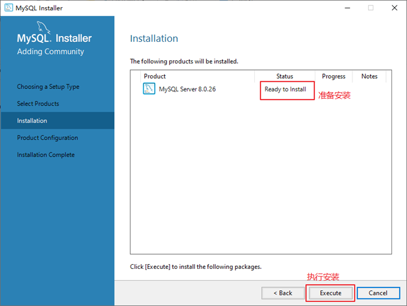


#### 4-2安装包版配置MySQL8.0

MySQL安装之后，需要对服务器进行配置。具体的配置步骤如下。
**步骤1**：在上一个小节的最后一步，单击“Next”（下一步）按钮，就可以进入产品配置窗口。


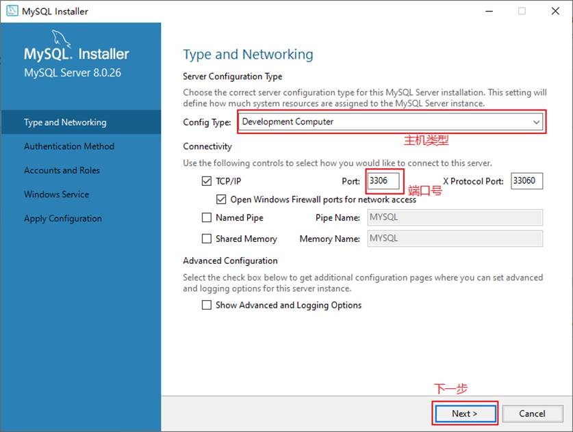

其中，“Config Type”选项用于设置服务器的类型。单击该选项右侧的下三角按钮，即可查看3个选项，如图所示。


Server Machine（服务器） ：该选项代表服务器，MySQL服务器可以同其他服务器应用程序一起运行，例如Web服务器等。MySQL服务器配置成适当比例的系统资源。

Dedicated Machine（专用服务器） ：该选项代表只运行MySQL服务的服务器。MySQL服务器配置成使用所有可用系统资源。


**建议选第二个**

**建议选第二个**

**建议选第二个**

**步骤4**：单击“Next”（下一步）按钮，打开设置服务器root超级管理员的密码窗口，如图所示，需要输入两次同样的登录密码。也可以通过“Add User”添加其他用户，添加其他用户时，需要指定用户名、允许该用户名在哪台/哪些主机上登录，还可以指定用户角色等。

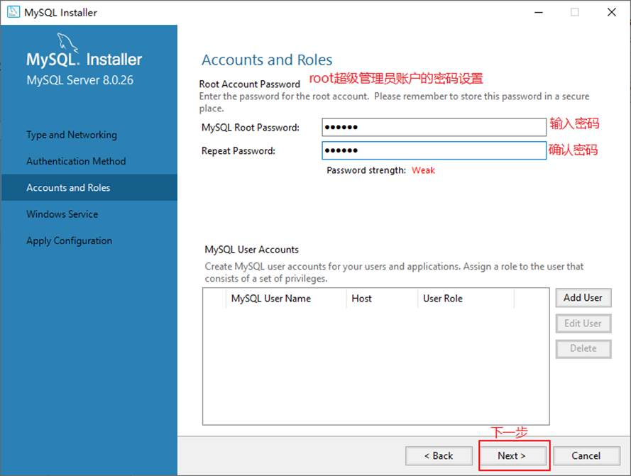

步骤5：单击“Next”（下一步）按钮，打开设置服务器名称窗口，如图所示。该服务名会出现在Windows服务列表中，也可以在命令行窗口中使用该服务名进行启动和停止服务。本书将服务名设置为“MySQL80”。如果希望开机自启动服务，也可以勾选“Start the MySQL Server at System Startup”选项（推荐）。

下面是选择以什么方式运行服务？可以选择“Standard System Account”(标准系统用户)或者“Custom User” (自定义用户)中的一个。这里推荐前者。

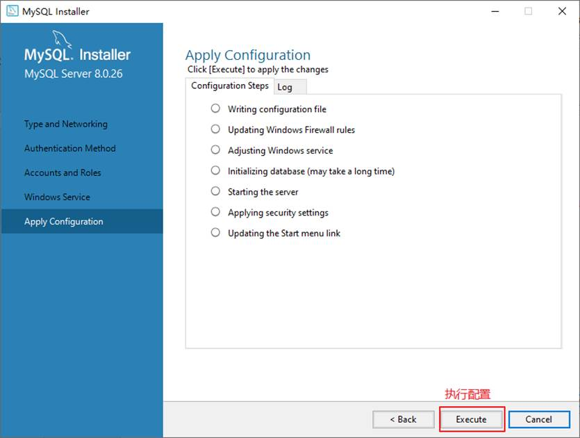

**步骤7**：完成配置，如图所示。单击“Finish”（完成）按钮，即可完成服务器的配置。

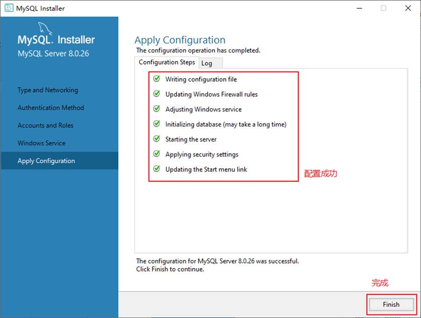**步骤8**：如果还有其他产品需要配置，可以选择其他产品，然后继续配置。如果没有，直接选择“Next”（下一步)，直接完成整个安装和配置过程。

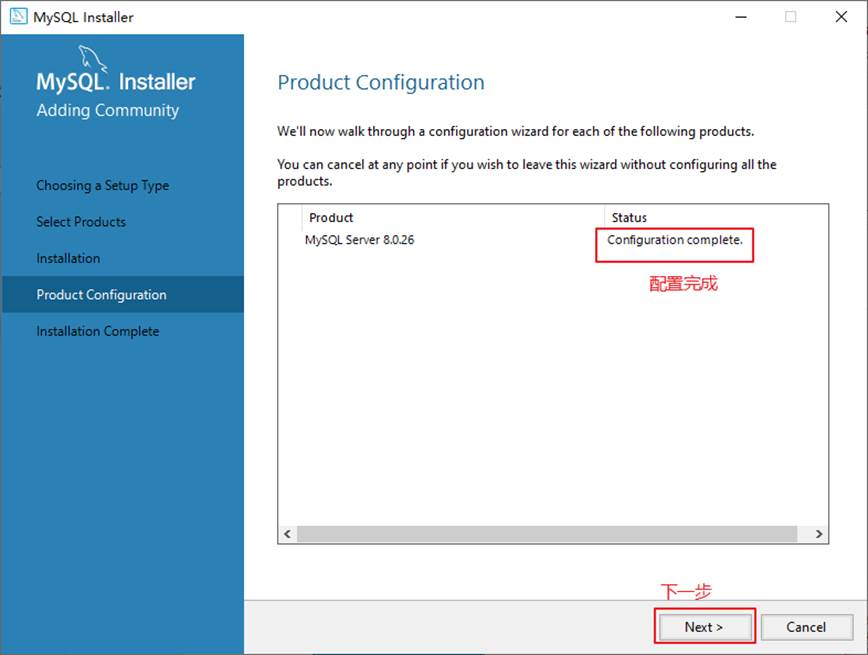

步骤9：结束安装和配置。


#### **4-3解压版安装**

解压版安装就非常简单，找到你要安装的位置解压就行，解压后如图

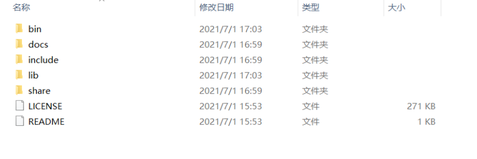

解压完就就OK了

#### 4-4解压版配置

1.新建一个文件my.ini 复制到根目录下，和bin文件夹同级

```ini
[mysqld]
# 设置3306端口
port=3306
# 设置mysql的安装目录   ----------是你的文件路径-------------
basedir=E:\mysql\mysql
# 设置mysql数据库的数据的存放目录  ---------是你的文件路径data文件夹自行创建
datadir=E:\mysql\mysql\data
# 允许最大连接数
max_connections=200
# 允许连接失败的次数。
max_connect_errors=10
# 服务端使用的字符集默认为utf8mb4
character-set-server=utf8mb4
# 创建新表时将使用的默认存储引擎
default-storage-engine=INNODB
# 默认使用“mysql_native_password”插件认证
#mysql_native_password
default_authentication_plugin=mysql_native_password
[mysql]
# 设置mysql客户端默认字符集
default-character-set=utf8mb4
[client]
# 设置mysql客户端连接服务端时默认使用的端口
port=3306
default-character-set=utf8mb4
```

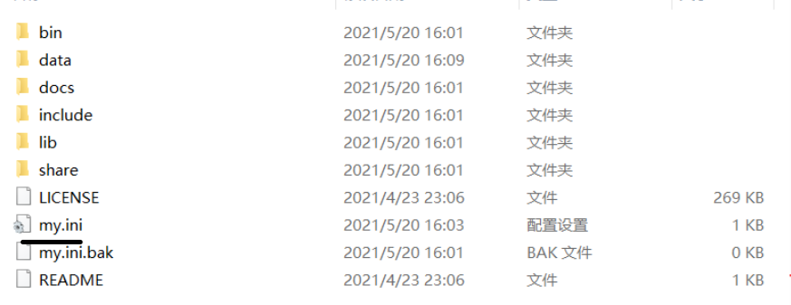

2.初始化mysql，直接在导航栏输入cmd回车


输入mysql初始化命令

```mysql
mysqld --initialize --console
```

复制root@localhost:之后的密码到本地文件夹，保存好( **: 后有一个空格，不复制**)

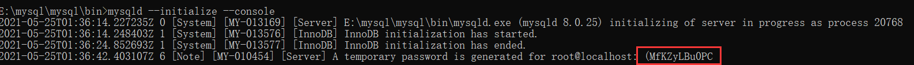3.安装mysql服务

输入安装mysql服务命令

```mysql
mysqld --install mysql
```

之后会提示服务已经成功安装

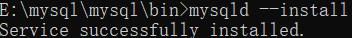

到了这里已经安装完成了，本人推荐使用安装包安装。

#### 4-5mysql的环境变量配置（可以不配置）

鼠标右键我的电脑，属性->高级系统设置->环境变量

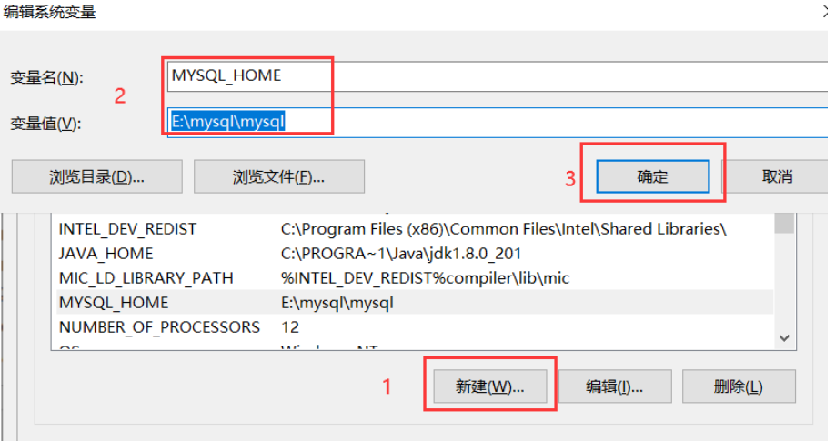

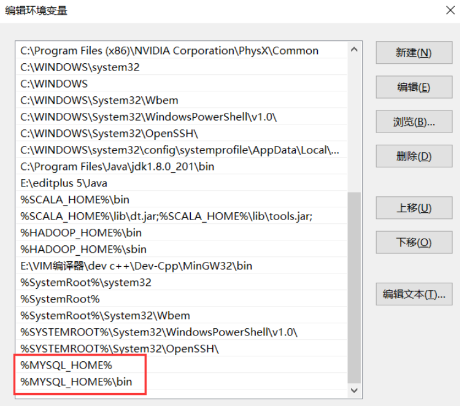

### 第五节MySQL的常见操作

#### 5-1登录MySQL

登录，如果你配置了环境变量就可以win+r，在运行框输入cmd，输入登录命令 

第一种：直接输入密码

```mysql
mysql -uroot -p(你的密码没有有括号)
```

第二种不直接输入密码

```mysql
mysql -uroot -p
```

前面两种都是localhost登录

下面是完整版

```mysql
mysql -h localhost -u root -proot
```

如果你没有配环境变量也没关系，在开始菜单找到

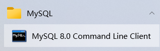

MySQL的客户端，


用MySQL的客户端直接输入密码就行

登录成功会显示MySQL的基本信息。

#### 5-2修改密码

1. **使用 SET PASSWORD 命令**

使用 SET PASSWORD 修改密码命令格式为

```mysql
set password for username @localhost = password(newpwd);
```

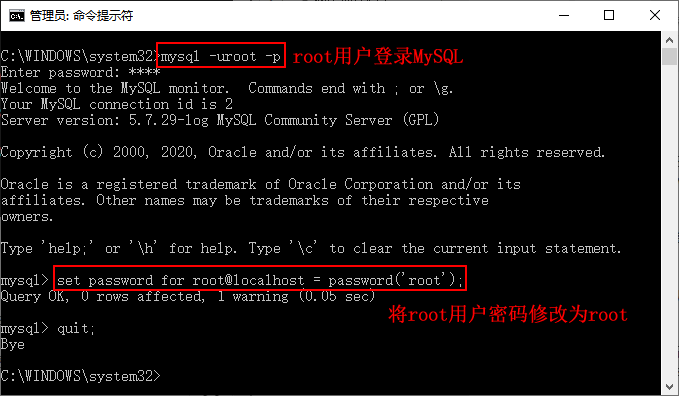

**2.使用mysqladmin修改密码**

```mysql
mysqladmin -u用户名 -p旧密码 password 新密码
```

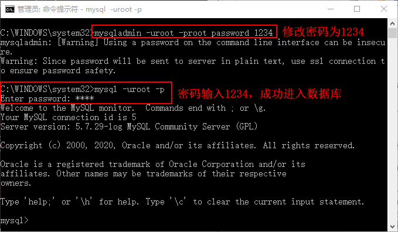

3.修改user表的数据达到修改密码的操作

步骤 1)：输入命令mysql -u root -p指定 root 用户登录 MySQL，输入后按回车键输入密码。如果没有配置环境变量，请在 MySQL 的 bin 目录下登录操作。

步骤 2)：输入use mysql;命令连接权限数据库。

步骤 3)：输入命令update mysql.user set authentication_string=password('新密码') where user='用户名' and Host ='localhost';设置新密码。

步骤 4)：输入 flush privileges; 命令刷新权限。

步骤 5)：输入quit;命令退出 MySQL 重新登录，此时密码已经修改为刚才输入的新密码了。

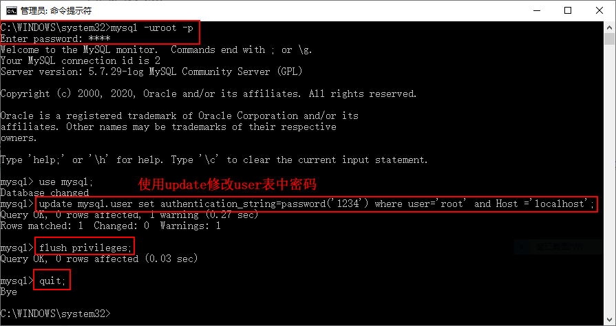

#### 5-3修改MySQL数据存放位置

如果你使用解压版，还没有初始化你可以直接修改，找到我们写的my.ini文件修改路径就行

我们已安装版为基础来讲解

先停止Mysql服务

```bash
net stop mysql
# (注意mysql8.0的服务名称可能是mysql80，此处应该为net stop mysql80)
```

然后在数据库安装目录中找到my.ini文件
然后找到datadir属性，把原来的值修改为新的数据库存储目录。
如原位置为：“datadir=C:/ProgramData/MySQL/MySQL Server 8.0\Data”
新位置为：“datadir=F:\MySQL\Data”
复制原data目录中的所有文件到新的存储位置。
启动服务

```undefined
net start mysql80
```

进入mysql后再使用如下命令

```dart
show variables like '%datadir%';
```

你会发现数据库的存储位置已经修改过来了。

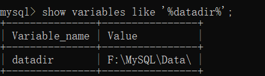

注意事项：
如果你的mysql使用的是安装包安装的且修改了默认安装位置，那么你可能找不到my.ini文件。那么你可以使用查看数据库文件所在位置的命令来找到my.ini文件。


